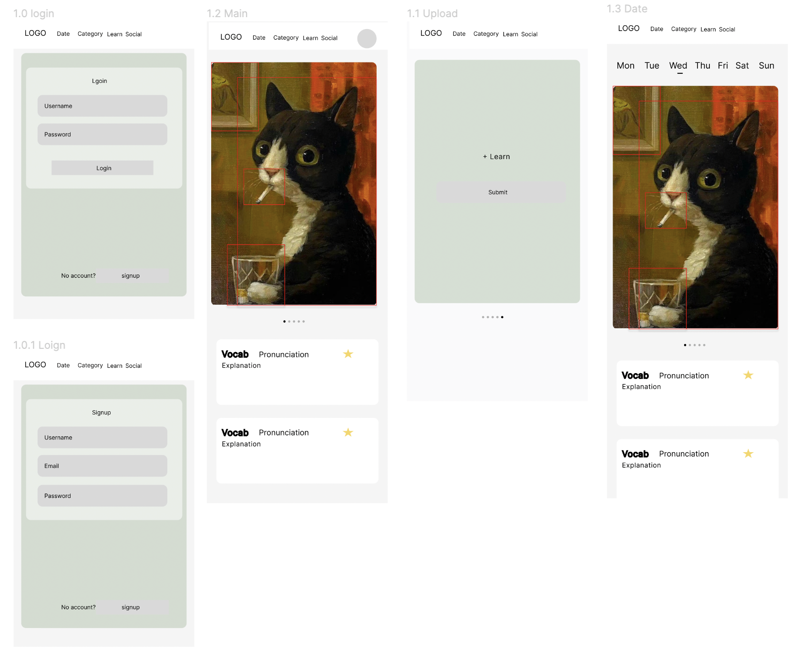
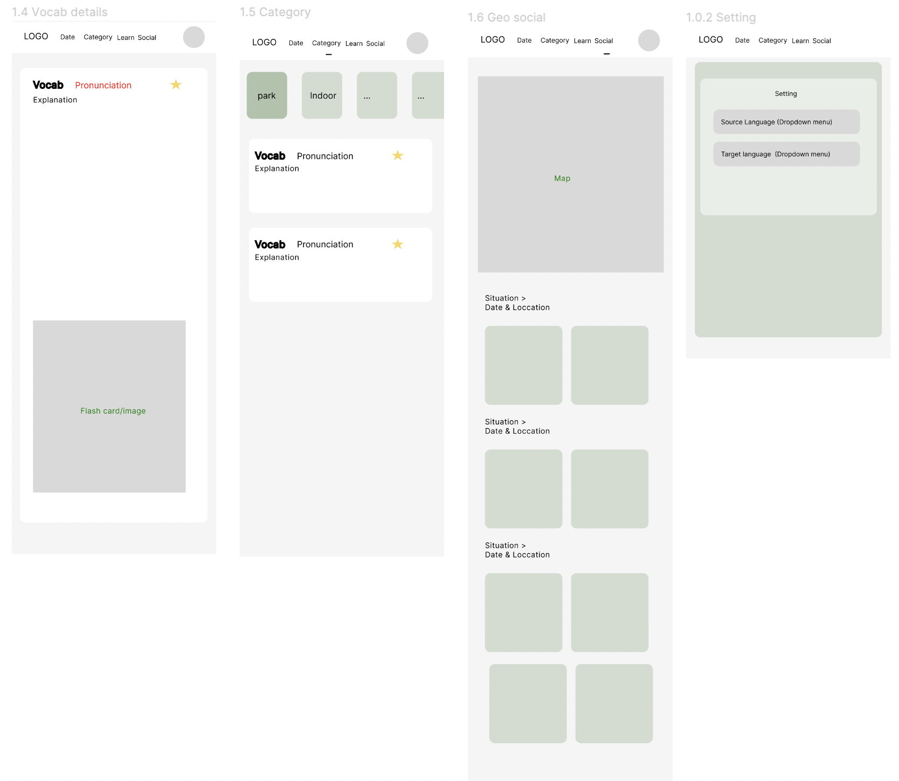
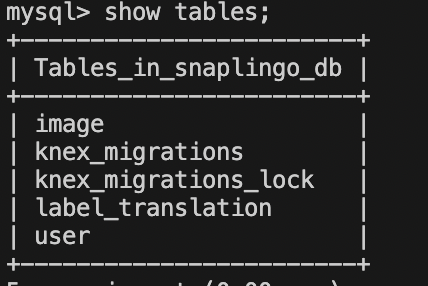

# SnapLingo

## Overview

SnapLearn revolutionizes language learning by integrating immersive experiences with active learning techniques to learn the language through our surrounding environment. It empowers users to effortlessly learn the target language through the lens of their surroundings. Whether you're exploring foreign lands, navigating daily life, or even teaching toddlers their first words, SnapLearn makes language acquisition an engaging and enjoyable journey.

### Problem

1. **Limited Time for Language Learning:** Many users face time constraints due to busy schedules, making it challenging to dedicate consistent time to language learning.

2. **Lack of Engagement:** Traditional language learning methods may feel dull and uninspiring, leading to low motivation and retention rates among learners.

3. **Difficulty in Applying Learning to Real Life:** Learners often struggle to apply the vocabulary they learn in real-life contexts, hindering their ability to communicate effectively in the target language.

4. **Overwhelmed by Complex Curriculum:** Some learners may feel overwhelmed by the complexity of language learning curriculums, especially if they are beginners or have limited prior exposure to the language.

5. **Challenges in Teaching Young Children:** Parents and caregivers may find it challenging to keep young children engaged and motivated during language learning activities, especially when using traditional teaching methods.


### User Profile

1. **Name:** Juju
   - **Age:** 23
   - **Background:** Juju is a travel enthusiast who works remotely as a digital nomad. She loves immersing herself in different cultures and exploring new destinations whenever she gets the chance. However, she often finds it challenging to learn the local language before her trips due to her busy schedule and limited time for formal language classes. Sarah is looking for a convenient and effective way to learn key phrases and vocabulary, which can be picked up quickly, to enhance her travel experiences.

2. **Name:** Tom
   - **Age:** 36
   - **Background:** Tom is a language learner who recently moved to a new country for work. Although he has been studying the local language for several months, he still struggles to communicate fluently in everyday situations. Tom finds traditional language learning methods tedious and less efficiency in daily usage, so he is looking for a more engaging and interactive approach to improve his language skills while balancing his demanding job and personal life.

3. **Name:** Emily
   - **Age:** 33
   - **Background:** Emily is a mother of two young children, aged 3 and 5. She wants to introduce her kids to a second language at an early age to give them a competitive edge in today's globalized world. However, Emily often feels overwhelmed by the prospect of teaching her children a new language, especially while managing household responsibilities and childcare duties. She is looking for fun and effective language learning activities to integrate into her children's daily lives, allowing them to become familiar with the language's usage environment. Emily wants to find a way to combine her children's interests with language learning, so they can effortlessly grasp new vocabulary and expressions while playing and learning, thus making language learning more efficient and practical.
   
### Features

1. **Immersive Learning Through Images:** SnapLearn allows users to learn vocabulary by snapping pictures of their surroundings. Simply take a photo of objects, scenes, or situations, and SnapLearn identifies relevant vocabulary for you to learn in the target language.

2. **Active Learning Anytime, Anywhere:** Whether you're traveling abroad, at home, or engaging in daily activities, SnapLearn provides an active learning environment whenever you want. Seamlessly integrate language learning into your life without interrupting your routines.

3. **Customized Learning Paths:** SnapLearn offers personalized learning paths tailored to your proficiency level and learning goals. Whether you're a beginner starting your language journey or an advanced learner looking to expand your vocabulary, SnapLearn adapts to your needs.

4. **Interactive Flashcards and Quizzes:** Reinforce your learning with interactive flashcards and quizzes. Test your knowledge, review vocabulary, and track your progress as you advance through the language curriculum.

5. **Child-Friendly Learning:** SnapLearn is perfect for young learners, providing a fun and interactive way for children to discover new words and concepts. Parents can guide their children's language development by capturing everyday moments and turning them into learning opportunities.


## Implementation

### Tech Stack

1. **Frontend:**
   - **React** 
   - **Chakra UI**
2. **Backend:**
   - **Node.js**
   - **Express.js** 
   - **MySQL**

3. **Authentication:**
   - **Authentication** 

4. **Image Recognition:**
   - **Google Cloud Vision API** 
   - **Open AI API** 
   
5. **Geo-socialization: (TBD)** 
   - **Google map API** 

7. **Vocab Details:**
   - **Merriam-Webster Dictionary API** 
   
8. **Version Control and Collaboration (TBD)**
   - **Git and GitHub**

### APIs
   - **Google Cloud Vision API** 
   - **Open AI API** 
   - **Merriam-Webster Dictionary API** 

### Sitemap

Main: The most recent **pictures&vocabulaties** for learning will be shown
Gallery: All the pictures that taken and used for learning are sorted by dates
Caputre: Click on **Capture**, users can take a picture to analyze the objects on the picture and learn vocabulary.
Category: All the pictures used for learning sorted by picture category, which is extracted by image classification algoritom.
Vocab Details: Show the pronunciation, explanation, pictures/generated flash cards of the vocab learnt already. 
Geo Social (TBD): Introduce map to show the location that user took the pics, and how many pics they took.

### Mockups
Mockups (only provided mobile):



### Data

1. Table image:
```
mysql> SELECT * FROM image LIMIT 10;
+-----------------------+-----------------------------------------------------------------------------------+------------------------------------------------+-------+---------+---------------------+---------------------+
| id                    | content_url                                                                       | object_labels                                  | isImg | user_id | created_at          | updated_at          |
+-----------------------+-----------------------------------------------------------------------------------+------------------------------------------------+-------+---------+---------------------+---------------------+
| -13Wf49QuSOndOErQ4XR1 | /Users/amberm/Documents/snaplingo-backend/uploads/image_-13Wf49QuSOndOErQ4XR1.jpg | ["Glasses", "Person", "Window"]                |     1 |       1 | 2024-05-04 20:03:35 | 2024-05-04 20:03:35 |
| -9xjmxl69YB1nNo9CQnMO | /Users/amberm/Documents/snaplingo-backend/uploads/image_-9xjmxl69YB1nNo9CQnMO.jpg | ["Glasses", "Person"]                          |     1 |       1 | 2024-05-04 18:30:25 | 2024-05-04 18:30:25 |
| -mAzV8J3lhuWroNyLaFzk | /Users/amberm/Documents/snaplingo-backend/uploads/image_-mAzV8J3lhuWroNyLaFzk.jpg | ["Glasses", "Person", "Stuffed toy", "Window"] |     1 |       1 | 2024-05-04 20:01:47 | 2024-05-04 20:01:47 |
| -sIPGfrBkOJUYPFULZ9N1 | /Users/amberm/Documents/snaplingo-backend/uploads/image_-sIPGfrBkOJUYPFULZ9N1.jpg | []                                             |     1 |       1 | 2024-05-04 18:26:46 | 2024-05-04 18:26:46 |
| -VXxV0l98XU0fjydxDpCF | /Users/amberm/Documents/snaplingo-backend/uploads/image_-VXxV0l98XU0fjydxDpCF.jpg | ["Glasses", "Mobile phone", "Person"]          |     1 |       1 | 2024-05-05 13:15:31 | 2024-05-05 13:15:31 |
| 0DRn1058IdwtTItfI5-Lv | /Users/amberm/Documents/snaplingo-backend/uploads/image_0DRn1058IdwtTItfI5-Lv.jpg | ["Glasses", "Person"]                          |     1 |       1 | 2024-05-04 19:58:15 | 2024-05-04 19:58:15 |
| 0y_JVBFO_wqzzilT3P-1u | /Users/amberm/Documents/snaplingo-backend/uploads/image_0y_JVBFO_wqzzilT3P-1u.jpg | ["Glasses", "Person"]                          |     1 |       1 | 2024-05-04 19:28:54 | 2024-05-04 19:28:54 |
| 10KvOG7pb3fBNytUghOCi | /Users/amberm/Documents/snaplingo-backend/uploads/image_10KvOG7pb3fBNytUghOCi.jpg | ["Glasses", "Person"]                          |     1 |       1 | 2024-05-04 18:53:42 | 2024-05-04 18:53:42 |
| 17lL7F7rWyyB788OExrVr | /Users/amberm/Documents/snaplingo-backend/uploads/image_17lL7F7rWyyB788OExrVr.jpg | ["Glasses", "Person"]                          |     1 |       1 | 2024-05-03 15:03:42 | 2024-05-04 14:02:09 |
| 1Cvf8pjQtcajBPCGxNMW- | /Users/amberm/Documents/snaplingo-backend/uploads/image_1Cvf8pjQtcajBPCGxNMW-.jpg | ["Glasses", "Person"]                          |     1 |       1 | 2024-05-04 18:29:22 | 2024-05-04 18:29:22 |
+-----------------------+-----------------------------------------------------------------------------------+------------------------------------------------+-------+---------+---------------------+---------------------+
10 rows in set (0.01 sec)
```

2. Table user:
```
mysql> SELECT * FROM user;
+----+-------+-------------------+----------+---------------------+---------------------+
| id | name  | email             | pwd      | created_at          | updated_at          |
+----+-------+-------------------+----------+---------------------+---------------------+
|  1 | Jojo  | Jojo@example.com  | Jojo123  | 2024-05-02 20:03:24 | 2024-05-02 20:03:24 |
|  2 | Juju  | Juju@example.com  | Juju123  | 2024-05-02 20:03:24 | 2024-05-02 20:03:24 |
|  3 | Amber | Amber@example.com | Amber123 | 2024-05-02 20:03:24 | 2024-05-02 20:03:24 |
+----+-------+-------------------+----------+---------------------+---------------------+
3 rows in set (0.01 sec)
```
3. Table label_translation:
```
mysql> SELECT * FROM label_translation LIMIT 10;
+----+--------------+--------------+-------------------------------------------------------------------------------------------------------------------------------------------------------------------------------------------------------------------------------------------------------------------------------+----------+----------+-----------------------+
| id | label        | translation  | explanation                                                                                                                                                                                                                                                                   | synonyms | language | image_id              |
+----+--------------+--------------+-------------------------------------------------------------------------------------------------------------------------------------------------------------------------------------------------------------------------------------------------------------------------------+----------+----------+-----------------------+
|  1 | Teacup       | teacup       | a small cup usually with a handle used with a saucer for hot beverages                                                                                                                                                                                                        |          | en       | uJuiZeN13iFMbZWk1jTrc |
|  2 | Mug          | mug:1        | a cylindrical drinking cup
the face or mouth of a person
grimace                                                                                                                                                                                                              |          | en       | uJuiZeN13iFMbZWk1jTrc |
|  3 | Teacup       | teacup       | a small cup usually with a handle used with a saucer for hot beverages                                                                                                                                                                                                        |          | en       | uJuiZeN13iFMbZWk1jTrc |
|  4 | Mug          | mug:1        | a cylindrical drinking cup
the face or mouth of a person
grimace                                                                                                                                                                                                              |          | en       | uJuiZeN13iFMbZWk1jTrc |
|  5 | Clothing     | clothing     | items (as of cloth) designed to be worn to cover the body; also : coverings                                                                                                                                                                                                   |          | en       | UhCdDbrKkYbSD3KNs_WqB |
|  6 | Mobile phone | mobile phone | cell phone                                                                                                                                                                                                                                                                    |          | en       | UhCdDbrKkYbSD3KNs_WqB |
|  7 | Mobile phone | mobile phone | cell phone                                                                                                                                                                                                                                                                    |          | en       | UhCdDbrKkYbSD3KNs_WqB |
|  8 | Person       | person       | human, individual —sometimes used in combination especially by those who prefer to avoid man in compounds applicable to both sexes
a character or part in or as if in a play : guise
one of the three modes of being in the Trinitarian Godhead as understood by Christians   |          | en       | UhCdDbrKkYbSD3KNs_WqB |
|  9 | Clothing     | clothing     | items (as of cloth) designed to be worn to cover the body; also : coverings                                                                                                                                                                                                   |          | en       | UhCdDbrKkYbSD3KNs_WqB |
| 10 | Mobile phone | mobile phone | cell phone                                                                                                                                                                                                                                                                    |          | en       | UhCdDbrKkYbSD3KNs_WqB |
+----+--------------+--------------+-------------------------------------------------------------------------------------------------------------------------------------------------------------------------------------------------------------------------------------------------------------------------------+----------+----------+-----------------------+
10 rows in set (0.00 sec)

```

### Endpoints

1. **(imageController) Image Recognition:**
   - **Endpoint:** `/uploadImage`
   - **Functionality:** Accepts user-uploaded pictures and performs image recognition using the Google Cloud Vision API to identify objects and extract relevant vocabulary.
   - **Integration:** Makes HTTP requests to the Google Cloud Vision API for image analysis.
   - **Data Storage:** Stores uploaded picture, user and vocabulary data in a database.

2. **(imageController) Content Management :**
   - **Endpoints:** `/getImagesByDate`
   - **Functionality:** Display all the pictures information sorted by date.

3.  **(recordsController)Recent records Management:**
   - **Endpoints:** `/getRecentRecords`
   - **Functionality:** Provides the most recent pictures data displayed on the main page based on most recent created time.
4. **(vocabController) Vocab management**
   - **Endpoints:** `/getVocabs`
   - **Functionality:** Retrives the vocabs data based on provided image id.


### Auth

Does your project include any login or user profile functionality? If so, describe how authentication/authorization will be implemented.

## Roadmap

**Duration:** 2 weeks

**Week 1: Planning and Setup**

1. **Preparation: Project Planning and Setup**
   - Define project requirements and goals
   - Create user stories and prioritize features
   - Set up version control (e.g., Git) and project repository

2. **Day 1-2: Frontend and Backend Setup**
   - Set up Google Cloud Platform (GCP) account
   - Enable Translation API and obtain API credentials
   - Set up backend environment (Node.js, Express.js)
   - Implement user authentication API endpoints (signup, login, logout)
   - Implement database schema for user profiles
   - Set up React js environment
   - Initialize project structure and dependencies
   - Implement basic navigation and layout components

4. **Day 3-4: Image Recognition Integration**
   - Integrate Google Cloud Vision API for image recognition
   - Implement API endpoint for analyzing user-uploaded images
   - Store image recognition data in the database
   
5. **Day 5: Language Content Management**
   - Design database schema for language content (languages, vocabulary)
   - Implement API endpoints for managing language content
   
6. **Day 6-7: set up cloud Database**
   
**Week 2: Development and Testing**

6. **Day 8: Testing and Bug Fixing**
   - Conduct unit tests for backend APIs
   - Perform integration testing for frontend and backend interactions
   - Identify and fix any bugs or issues
7. **Day 9-10: Agile for Image Recognition API**
    - Add the explaination of the target with dictionary API (like Merriam-Webster API)
    - Add the generated flesh card contents for the targets
    - Add the searching category (photo/word) of vocabulary list
8. **Day 11: Testing and Bug Fixing**

**Day 12-13: Deployment and Documentation**
   - Deploy backend to cloud hosting (e.g., AWS, Google Cloud)
   - Write documentation for setup, usage, and maintenance of the application

**Post-Sprint: Ongoing Maintenance and Iteration**

- Monitor application performance and user feedback
- Address any issues or feature requests that arise
- Plan for future sprints to implement additional features and improvements

## Nice-to-haves
1. Basic requirements:
- Use camera
- Take pictures
- Recognize pictures
- Translate the objects on the pictures
- Store the user/image/vocabulary data
- Retrieve images and vocabulary data
- Images sorted by dates

2. Further requirements:
- Flesh card generation
- Vocabs sort by category
- Vocab details
- Geo info sharing
- Vocab "Like" list


## Implementation

### Frontend setup 
- Create remote git repo
- Create React app: `npx create-react-app snaplearn`
- Setup development environment: `npm install react-router-dom @mui/icons-material @mui/joy @emotion/react @emotion/styled sass axios `
