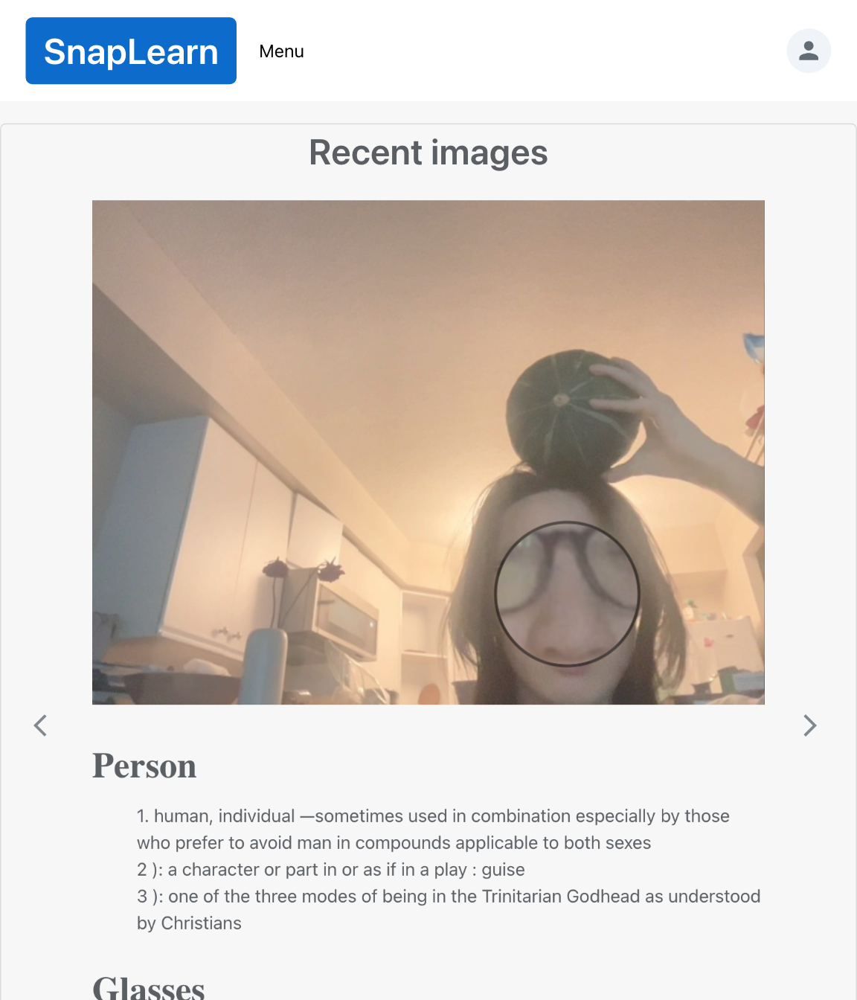
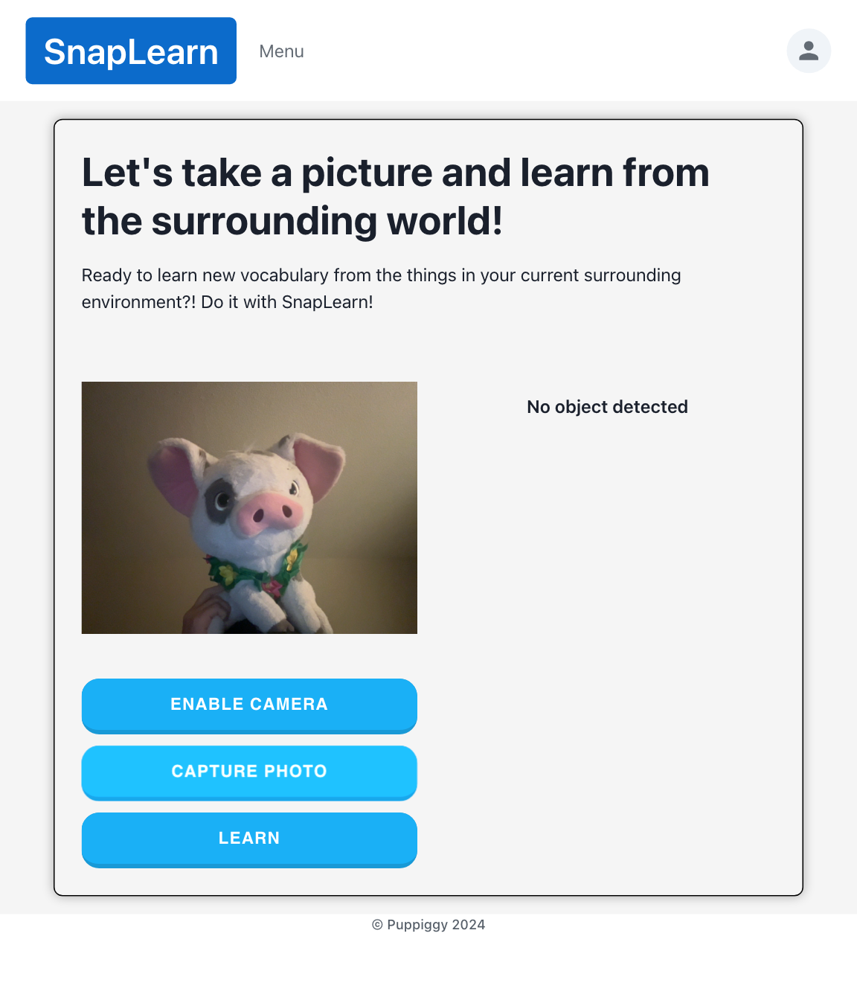
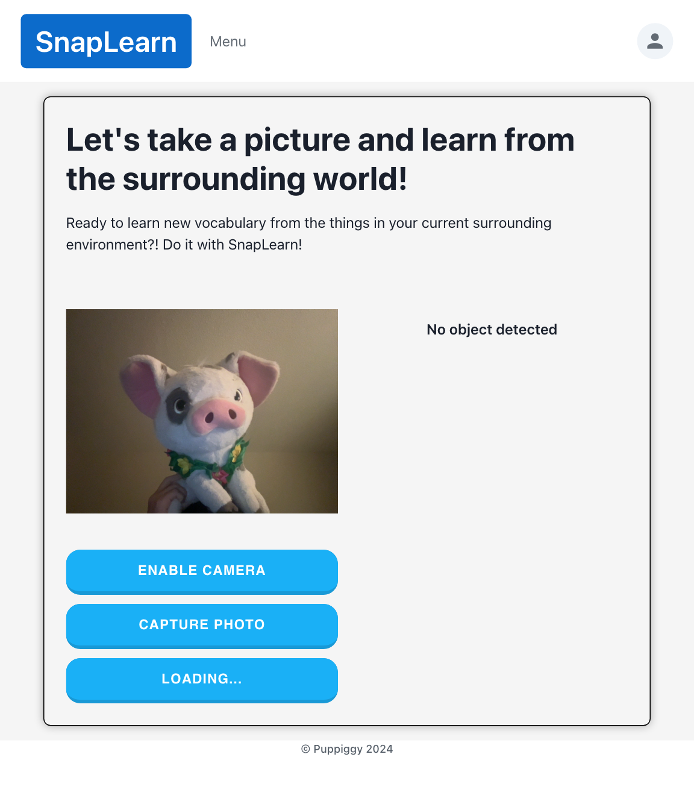
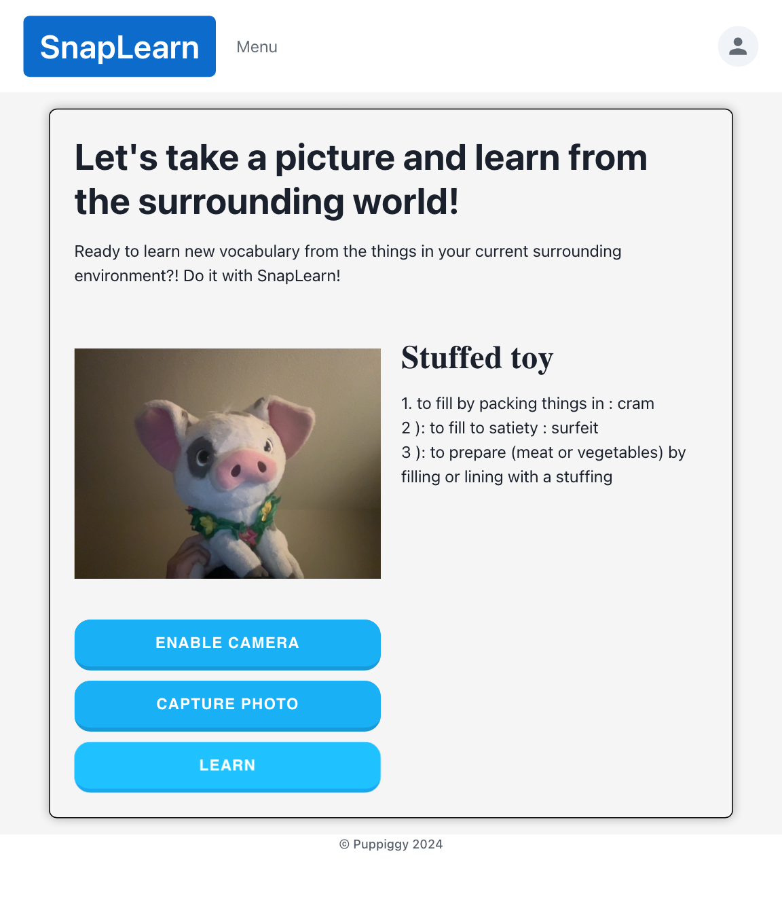
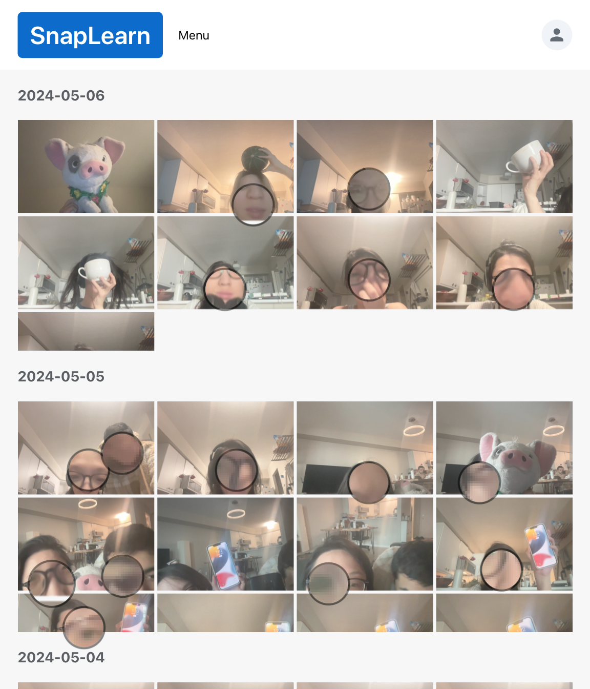
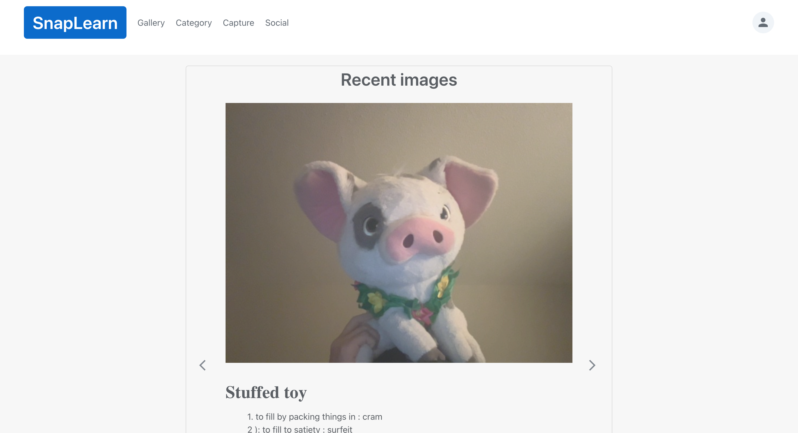
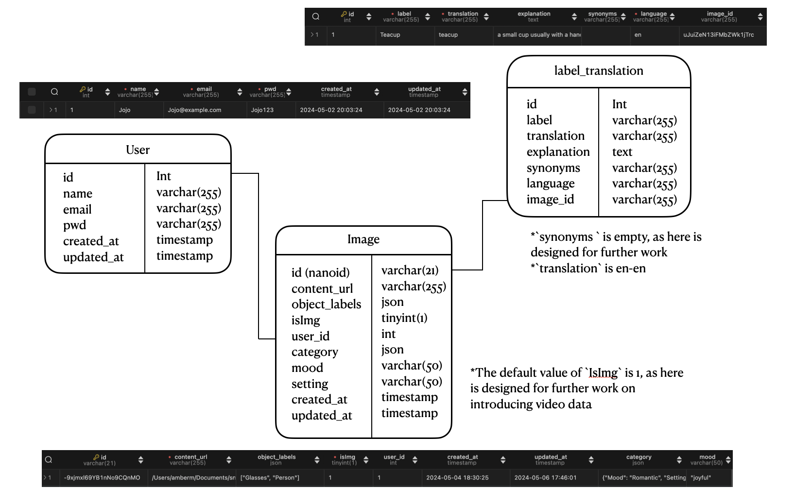

### SnapLearn

<!-- ABOUT THE PROJECT -->
## Overview

SnapLearn revolutionizes language learning by integrating immersive experiences with AI-engaged techniques to learn the language through our surrounding environment. It empowers users to effortlessly learn the target language through the lens of their surroundings. Whether you're exploring foreign lands, navigating daily life, or even teaching toddlers their first words, SnapLearn makes language acquisition an engaging and enjoyable journey.

## About the project
### UI
* Tablet screen: 
    1. Main page, shows most recent pictures/learning:
    
    2. Capture page, take a picture and learn the objects in your surrounding!
    * Enable camera and capture the picture: 
    
    * Loading: 
    
    * Detected objects: 
    
    3. Gallery page:
    
* Desktop screen (partial):
    1. 

### Built With

This section should list any major frameworks/libraries used to bootstrap your project. Leave any add-ons/plugins for the acknowledgements section. Here are a few examples.
* Front-end
    * React.js
    * Chakra-ui
    * Google cloud version API

* Back-end
    * SQL
    * Express.js
    * Google Gemini API
    * Merriam-webster API

### Database

## Quick Start
1. under the `snaplearn` folder
2. `npm install` to install all the dependencies
3. Consider introduce environment variables into `/utils/utils.js` or `.env`, such as `API_URL`, `Client_URL` and `GEMINI_API_KEY` 
    * Generate [Gemini API KEY](https://aistudio.google.com/app/prompts/new_chat)
4. `npm start` start the project

<!-- CONTACT -->
## Contact

Hongfan(Amber) Mu - [@linkedin](www.linkedin.com/in/hongfan-mu) - hmu026@icloud.com

